# Realty - Real Estate Searcher application developted with MERN Stack.

## Hosted Application: https://mern-properties.netlify.app

 Realty is a real estate application suitable for users who are willing to buy a new property, posted by various sellers. It includes a a numerous list of functionalities such as:
 - `Global Live Chat:` Real time chat feature in wich users can talk amoung themselves, over eachother advices and react to messages. Unread alerted by a distinctive sound, an unread message count, and a last message preview.
 - `Notification Sistem:` Real time notification system in wich user is informed whenever other users interact with his activity in the website. Users can like or dislikes your questions on a property, leave a review on his profile, and post a question on a property listed by the user.
 - `Browse Properties:` Users can browse, filter and sort through the various property listings available.
 - `Add Property:` Users can add properties that they are willing to sell.
 - `Post a Question:` Users can post questions on any property should they have any additional information that they need. Only the property owner can reply to this questions.
 - `Like & Dislike:` Users can like or dislike any question or reply from a property.
 - `Wishlist Properties:` Users can add/remove any property they are interested into.
 - `Promote:` Users can promote a property if they have the necessary founds. Promoted properties are based on tiers and show first in the catalog list of properties.
 - `Add Funds:` User can add fake money to their account trough a fake payment method. User funds can be spent to promote properties.
 - `Personal-Info:` Users can edit their personal info such as, display name, avatar, email and others.
 - `Change-Password:` Users can change their current password.
 - `User-Public-Profile:` Users can view any other users profile.
 - `Leave a Review:` Users can leave a review for other users on their profile.
 - `Login-Register:` In other to access various functionality on the application, users can login/register.

## PRINT-SCREENS

`1.Global Live Chat:`

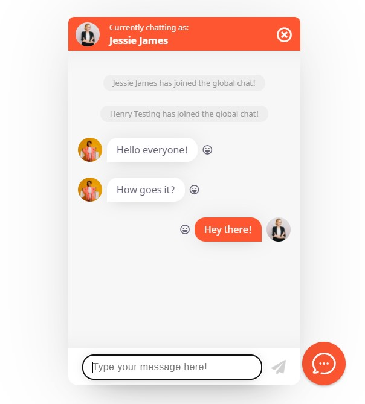

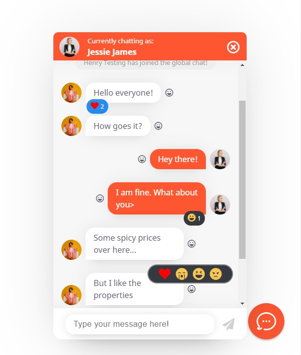

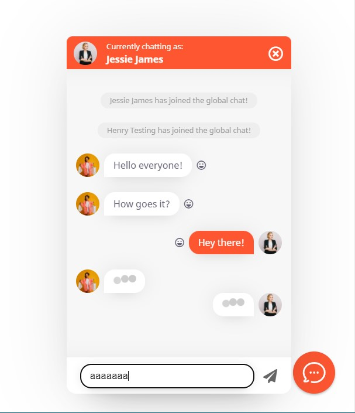

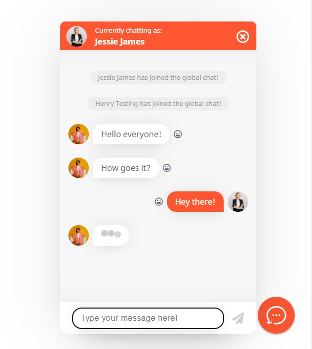

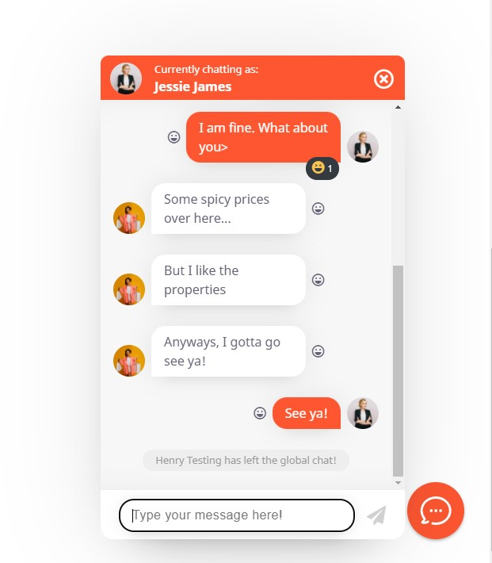

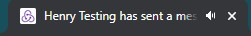

`2.Notification System:`

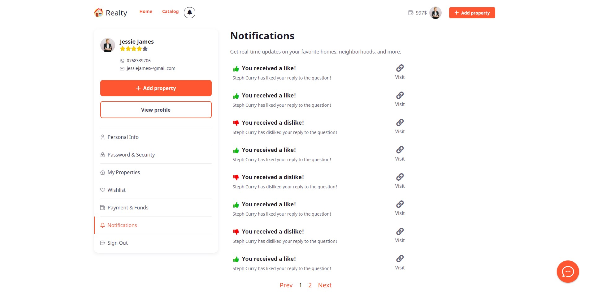

`3.Browse Properties:`

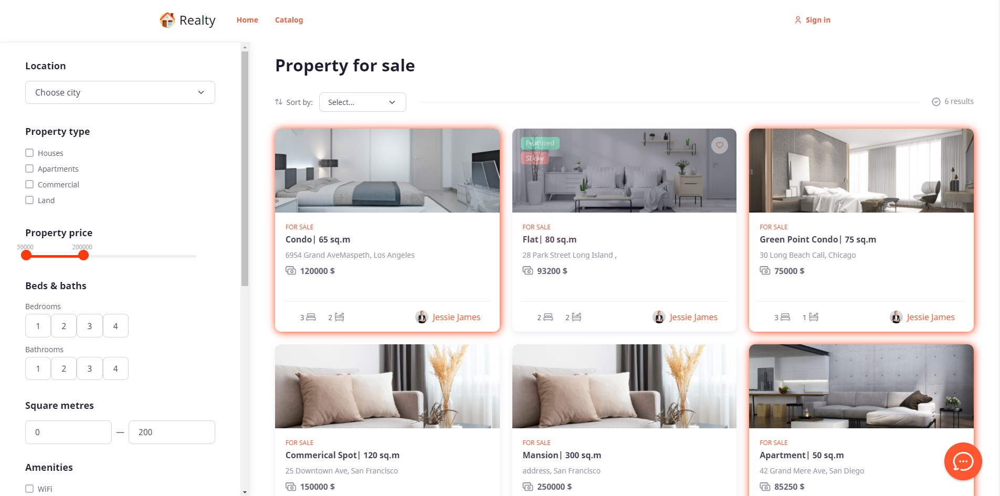

`4.Property Presentation Page:`

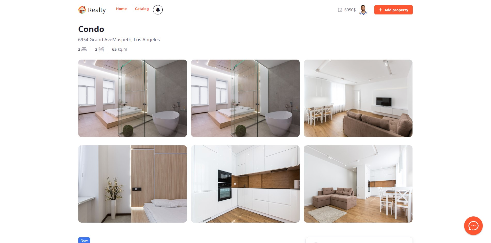

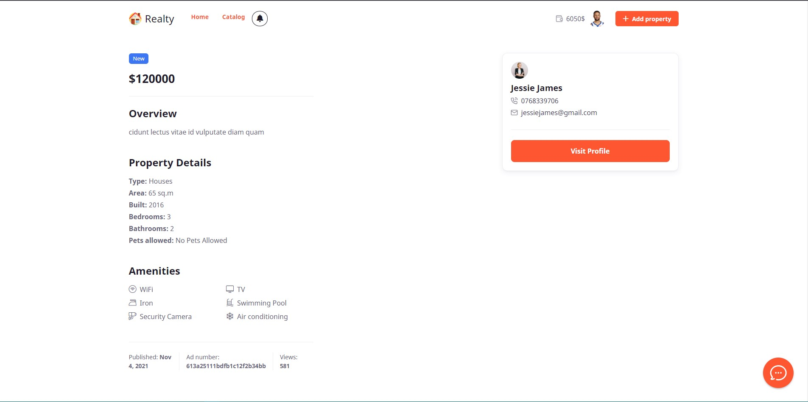

`5.Add Properties:`

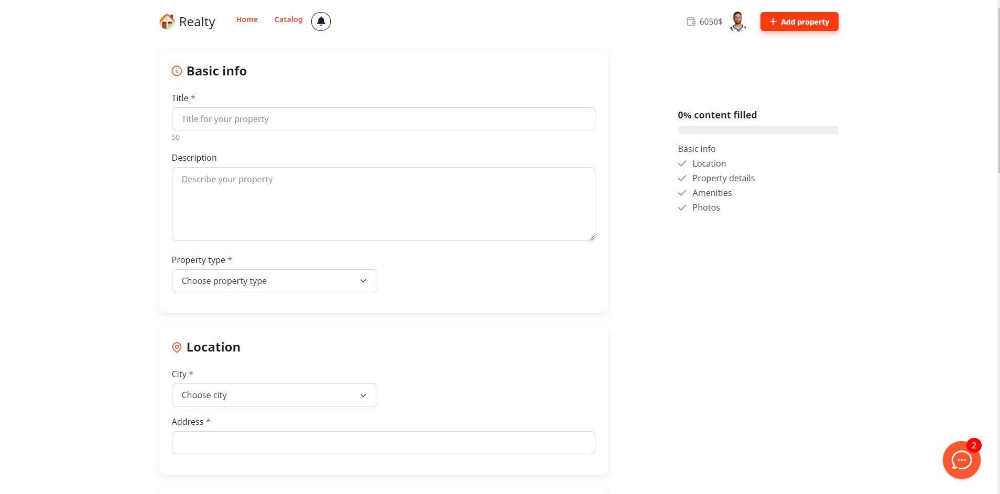

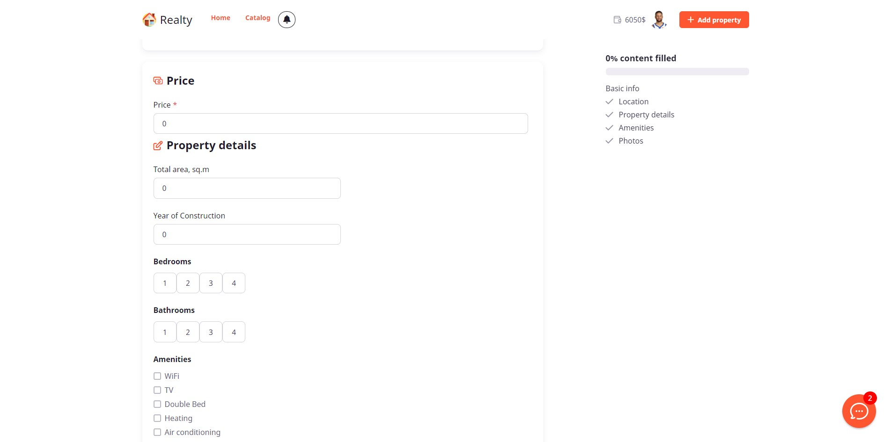

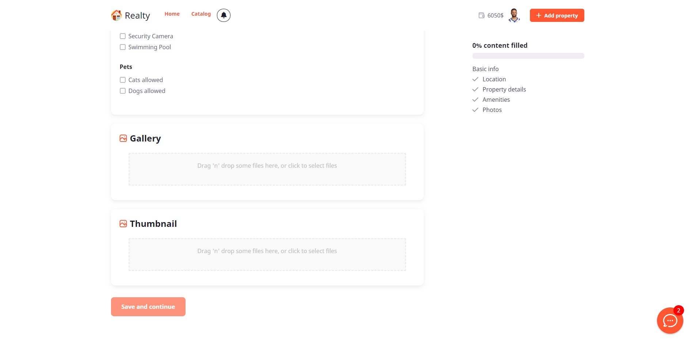

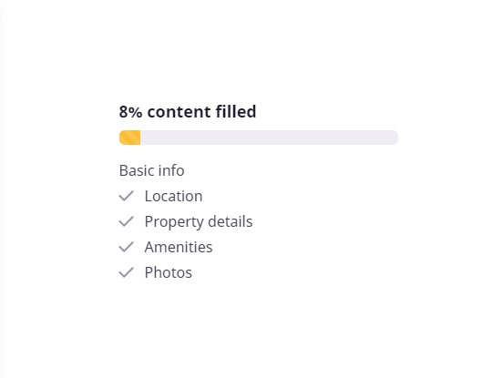

`6.Post a question:`

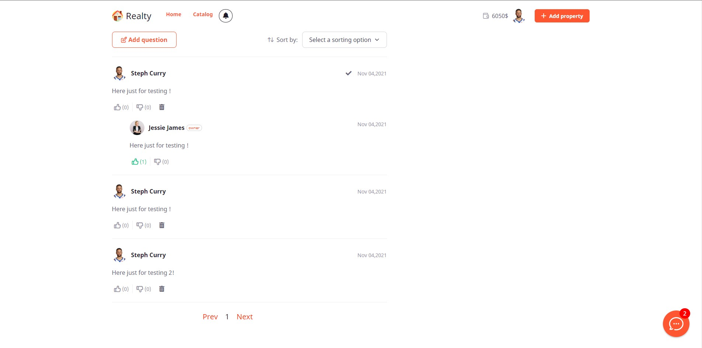

`7. Wishlist Properties:`

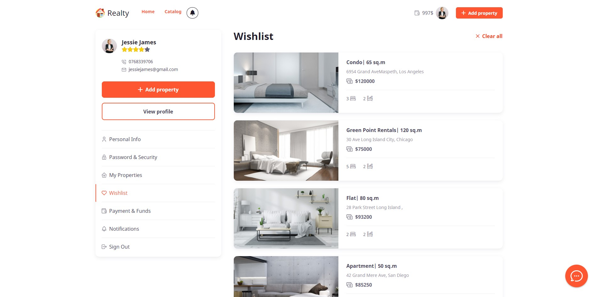

`8.Promote Property:`

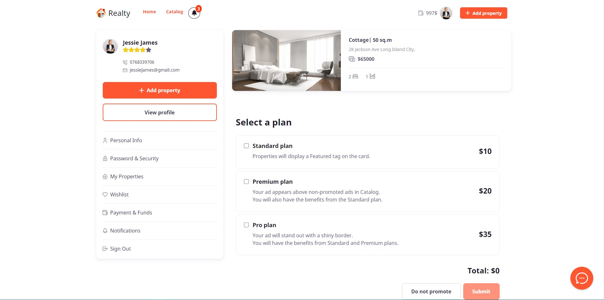

`9. Add funds:`

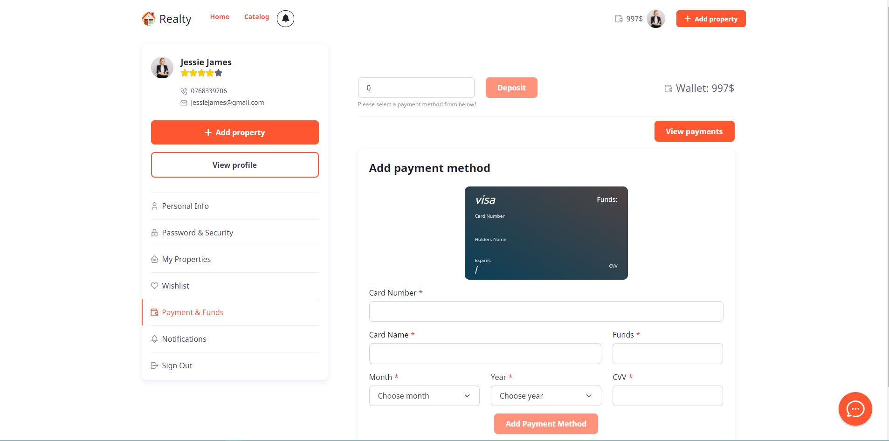

`10.Personal Info:`

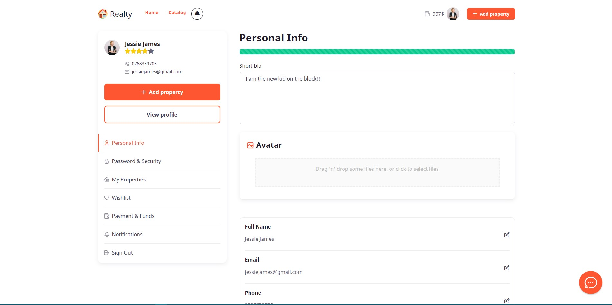

`11.User Public Profile:`

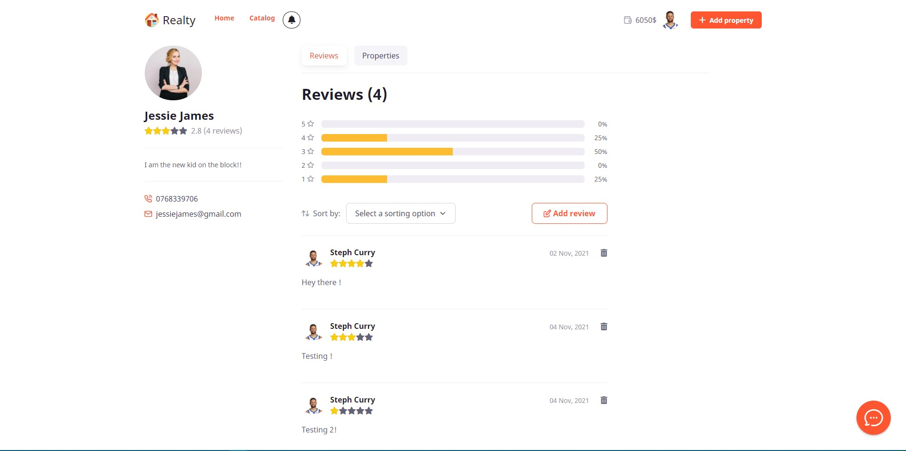

`12.Presentation Page:`

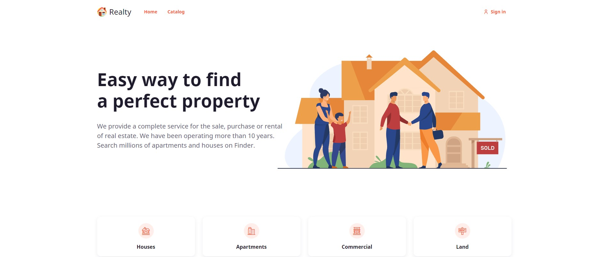

`13.Login/Register:`

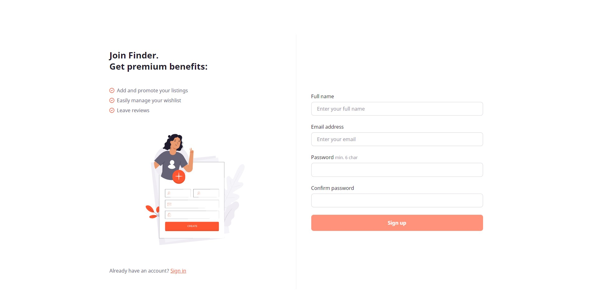

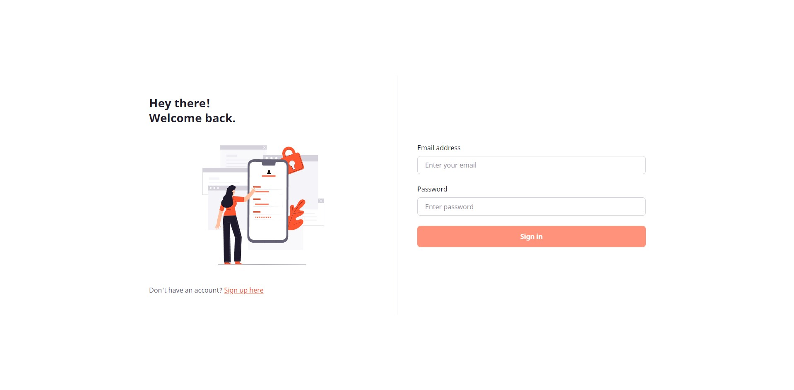

## Or run the project locally:

### `1. npm install`
### `2. npm start`
